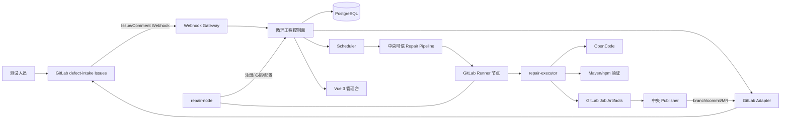

# 循环工程一期架构设计

- 状态：已完成交互式设计，待书面审阅
- 日期：2026-07-18
- 适用范围：公司内网、自建 GitLab、Java 后端、Node + Vue 2/3 前端

## 1. 结论摘要

一期采用“GitLab 原生能力 + 自建控制面”的路线：

- 使用一个专用 GitLab `defect-intake` 项目的 Issues 作为缺陷入口。
- 使用 GitLab Webhook 驱动自建循环工程控制面。
- 使用 GitLab Runner 执行修复任务，使用轻量 `repair-node` 管理节点注册、心跳和远程配置。
- 使用 OpenCode 作为一期默认 AI 修复内核；先通过 CLI JSON、Headless Server、SSE 和 Plugin 扩展，协议能力不足时才维护内部 Fork。
- 使用中央可信 Pipeline，避免个人电脑执行任意业务仓库可修改的 CI 配置。
- 个人节点只读拉取代码并生成候选补丁；中央 Publisher 使用服务端凭据创建分支、commit 和 Merge Request。
- 只有代码变更、规定的构建/单元测试、结果上传和 MR 全部成功，缺陷才进入“候选修复待测试”。系统不自动宣称缺陷已经解决。

一期控制面采用 Spring Boot、PostgreSQL、Flyway、Vue 3 + TypeScript；当前单节点并发不超过 10，因此不引入 Redis、Kafka、NATS、Temporal、Kubernetes 或独立对象存储。

## 2. 目标与非目标

### 2.1 一期目标

1. 测试人员在 GitLab Issue 中提交文字、截图和环境信息。
2. Webhook 触发控制面，并可靠、幂等地保存缺陷快照。
3. 信息不足时在原 Issue 上设置“待补充”，并明确列出缺失内容。
4. 信息充分后，根据项目目录确定代码仓库、模块、基线、上下文和验证命令。
5. 在已注册且能力匹配的服务器或个人电脑上执行代码拉取、AI 修复、构建和单元测试。
6. 生成可审阅的分支、commit 和 MR，并将 Issue 置为“待测试”。
7. 管理台可以查看修复明细、节点状态、节点描述、项目配置、失败原因和完整审计轨迹。
8. 从一期开始保留足够的事件和引用，为后续整链路归档与测试闭环准备数据。

### 2.2 一期不做

- AI 或人工功能测试调度与自动验收。
- 自动合并、部署、发布、关闭 Issue 或宣称缺陷已经解决。
- Jira、禅道、Plane 等独立缺陷平台接入。
- 公网节点、NAT 穿透和跨互联网零信任接入。
- 多节点协同修复同一个缺陷。
- Cursor 默认执行器；一期只预留执行器接口。
- 完整归档导出、统计数据仓库和成本核算平台。

## 3. 总体架构



### 3.1 组件职责

| 组件 | 职责 | 不承担的职责 |
|---|---|---|
| GitLab Issues | 缺陷入口、截图、评论、标签、用户协作 | 调度与修复执行 |
| 控制面 | 状态机、项目路由、调度、幂等、审计、管理 API | 直接调用模型 |
| GitLab Runner | 领取和运行中央可信 Job，上传日志与 Artifacts | 节点业务状态管理 |
| repair-node | 注册、设备身份、能力探测、心跳、远程配置、Runner 管理 | AI 推理和代码发布 |
| repair-executor | 组装上下文、调用执行器、运行验证命令、规范化事件和结果 | 保存模型密钥 |
| OpenCode | 代码分析、修改和测试失败后的有限修正 | 缺陷状态和 GitLab 写入 |
| Publisher | 校验补丁、创建分支/commit/MR、关联 Issue | AI 修复和节点调度 |
| PostgreSQL | 权威状态、事件、Outbox、租约和配置版本 | 大文件永久存储 |

## 4. 开源组件选型

### 4.1 一期采用

| 能力 | 组件 | 选择理由 |
|---|---|---|
| 缺陷入口 | GitLab Issues | 已在内网部署；支持附件、评论、标签和 Webhook |
| 节点执行 | GitLab Runner | 支持 Linux、macOS、Windows；注册、标签、状态和日志现成 |
| AI 修复 | OpenCode | MIT 许可；支持非交互 CLI、JSON、Server、OpenAPI、SSE 和 Plugin |
| 控制面 | Spring Boot | 团队 Java 技术栈一致，便于事务、鉴权、集成和运维 |
| 数据库 | PostgreSQL | 同时承担业务数据、Outbox、低并发队列与租约 |
| 数据迁移 | Flyway | 数据库结构版本化 |
| 管理台 | Vue 3 + TypeScript + Vite + Element Plus | 团队前端技术栈一致，适合管理系统 |
| 节点伴侣 | Go 单文件程序 | 跨平台分发、服务化和升级简单 |
| 可观测性 | Micrometer/OpenTelemetry + Prometheus/Grafana | 复用 Java 生态，支持指标和追踪 |

### 4.2 暂不采用

- Temporal：长流程恢复能力强，但一期人工等待和流程复杂度尚可由状态机、租约、Outbox 处理。
- NATS/Kafka/RabbitMQ：当前吞吐量很低，PostgreSQL 已能满足可靠排队和重试。
- Kubernetes：节点主要是服务器和个人电脑，Kubernetes 不能解决本机开发环境注册问题。
- MinIO：一期大文件复用 GitLab Job Artifacts，控制面仅保存索引与摘要。

当任务量、跨天人工等待、自动测试分支或多阶段补偿显著增加时，再评估 Temporal；当节点不再通过 GitLab Runner 执行时，再评估 NATS JetStream。

## 5. GitLab 缺陷入口

### 5.1 专用 defect-intake 项目

一期创建独立 GitLab 项目 `engineering/defect-intake`：

- 测试人员只需要访问该项目，不需要访问所有代码仓库。
- 只配置一个项目 Webhook，不依赖 GitLab Premium 的 Group Webhook。
- 业务项目和代码仓库由控制面的项目目录映射。
- 项目中统一维护 Issue 模板、状态标签和机器人评论格式。

### 5.2 Issue 模板

模板包含以下字段：

- 标题：一句话描述现象。
- 所属业务项目：必填；允许填写“不确定”，但会触发待补充或人工路由。
- 版本/环境：必填，如测试环境、分支、构建版本、浏览器或客户端版本。
- 模块/页面/API：知道时填写；多模块项目无法推断时必须补充。
- 复现步骤：必填。
- 预期结果：必填。
- 实际结果：必填。
- 截图/日志：按缺陷类型选填；前端视觉问题必须提供截图。
- 严重程度和补充说明：选填。

一期的信息完整性判断采用确定性规则，不依赖中央模型。截图和附件在修复任务执行时交给节点本地 OpenCode；如果节点模型不支持视觉，则仍以文字信息为准。

### 5.3 对外状态

使用互斥 scoped label `repair::<value>`：

| 标签 | 含义 |
|---|---|
| `repair::new` | 新收到，尚未解析 |
| `repair::triaging` | 正在校验和路由 |
| `repair::needs-info` | 信息不足，等待提交人补充 |
| `repair::queued` | 信息充分，等待节点 |
| `repair::running` | 节点正在修复或验证 |
| `repair::blocked` | 环境、权限或资源阻塞，需要人工处理 |
| `repair::failed` | 当前尝试失败，未达到待测试门槛 |
| `repair::ready-for-test` | 候选修复和 MR 已生成，等待测试 |
| `repair::cancelled` | 人工取消 |

机器人评论必须使用“候选修复”“待测试”等措辞，不使用“已经解决”“修复完成”等未经测试确认的表达。

## 6. 状态机与幂等

### 6.1 内部状态

控制面内部使用更细状态：

- 主路径：`RECEIVED → TRIAGING → READY → RESERVING → DISPATCHED → RUNNING_AGENT → VALIDATING → UPLOADING_RESULT → PUBLISHING → READY_FOR_TEST`。
- 信息不足：`TRIAGING → WAITING_INFO`；收到有效补充后回到 `TRIAGING`。
- 异常路径：任一允许重试的执行状态可进入 `RETRY_WAIT`；不可自动恢复时进入 `BLOCKED` 或 `FAILED`；人工取消进入 `CANCELLED`。

### 6.2 触发规则

1. Issue 创建或有效编辑后进入 `TRIAGING`。
2. 缺少字段时进入 `WAITING_INFO`，更新标签并发表缺失项清单。
3. Issue 正文编辑或提交人新增补充评论后重新进入 `TRIAGING`。
4. 项目、仓库、模块和代码基线均可解析后进入 `READY/QUEUED`。
5. 同一 Issue 同一内容版本最多存在一个活动 repair task。
6. 控制面自身产生的标签/评论 Webhook 只做对账，不创建新任务。

### 6.3 幂等键

- Webhook：`gitlab_project_id + X-Gitlab-Event-UUID`；缺少 UUID 时使用载荷摘要和事件时间窗口。
- 缺陷版本：Issue `updated_at` 与正文、标签、有效补充评论的摘要。
- 修复任务：`defect_id + defect_revision`。
- 尝试：`task_id + attempt_no`。
- 发布：固定分支 `ai-fix/<issue-iid>/<task-short-id>-<attempt>`。
- MR：按 source branch 查询后创建，已存在时转为对账。

所有 GitLab 写操作先写入 `outbox_event`，异步执行并可安全重试。

## 7. 项目目录与上下文

每个业务项目维护版本化 `project_profile`：

- GitLab Project ID、仓库 URL、默认分支和允许的维护分支。
- 业务模块到代码目录、Maven module、前端 package 的映射。
- 上下文入口：`AGENTS.md`、README、架构文档、模块说明、代码所有者。
- 必选构建、单元测试、lint 命令和超时。
- 允许的 OS、节点、执行器和最低工具能力。
- OpenCode Profile 名称及组织级权限策略。
- 最大外部 Attempt 数和每个 Attempt 内测试反馈轮数。
- 分支前缀、目标分支、默认 Reviewers 和 MR 模板。
- 工作目录和 Artifact 保留策略。

任务创建时保存完整配置快照，后续配置变更不改变历史任务的解释依据。

## 8. 节点注册与治理

### 8.1 注册流程

1. 管理员或项目负责人在管理台创建一次性邀请码；默认 10 分钟失效，只能使用一次，并包含允许项目范围。
2. 用户安装 `repair-node`，执行 `repair-node join --server <url> --code <code>`。
3. `repair-node` 生成设备密钥并申请设备证书，不上传用户模型密钥。
4. 节点上报 OS、架构、CPU、内存、磁盘、Java、Maven、Node、npm/pnpm、OpenCode、Docker 等能力。
5. 控制面通过 GitLab Runners API 创建 Runner；节点以唯一标签 `repair-node-<node-id>` 注册为中央修复项目 Runner。
6. 一次性邀请码本身代表管理员预授权；节点拥有者在本机确认项目白名单后，节点进入 `ACTIVE`。没有有效邀请码的设备不能注册。

Runner 设置为不接收 untagged job，并只绑定中央修复项目。repair-node 负责安装、启动、停止和配置 Runner 服务。

### 8.2 健康与配置

- 心跳周期：15 秒。
- 45 秒无心跳：标记 `OFFLINE`；60 秒内不进行破坏性重派，先查询 GitLab Job 终态。
- 状态：`ONLINE`、`BUSY`、`DEGRADED`、`DRAINING`、`OFFLINE`、`DISABLED`。
- 上报内容：活动任务、可用槽位、CPU/内存/磁盘、Runner 状态、工具版本、最近错误。
- GitLab Runner API 的 online/offline/stale 作为第二健康信号。
- 远程配置使用 desired-state revision；节点应用后回传 applied revision。
- 远程可配置并发默认 2，最小 1，最大 10；控制面信号量与 Runner 本地 limit 双重约束。
- 节点拥有者可以暂停、Drain、限制项目、限制命令和调整本地工作目录。

### 8.3 调度

硬过滤顺序：

1. 节点已启用且健康。
2. 节点和任务项目互相授权。
3. OS/架构符合项目 Profile。
4. Java/Node/OpenCode 等工具能力满足要求。
5. 存在空闲并发槽位，磁盘和内存达到阈值。

排序优先级：人工指定节点、项目负责人节点、存在仓库缓存、历史成功率、当前负载、最久未接单。

控制面先创建 120 秒 reservation，再触发带唯一 runner tag 的中央 Pipeline。Job 未在租约内启动则释放 reservation；Job 已启动后以 GitLab Job 状态和任务事件共同续租。

## 9. 修复执行流程

1. 控制面构建任务包：Issue 快照、附件引用、项目配置快照、目标 Base SHA、上下文入口、验证命令和短期任务令牌。
2. 触发中央修复项目 Pipeline，通过唯一 tag 定向到目标 Runner。
3. repair-executor 在 Runner 隔离工作目录中只读克隆目标仓库。优先使用被目标项目 allowlist 授权的中央 Pipeline `CI_JOB_TOKEN`；不具备该能力的 GitLab 版本使用项目级只读 Deploy Token。
4. 克隆完成后清理 Git 凭据环境；OpenCode 进程不能读取 GitLab 写凭据。
5. repair-executor 获取附件的短期代理地址，把文字、图片和项目上下文交给 OpenCode。控制面代取 GitLab 附件，因此不会把缺陷系统服务凭据下发给节点。
6. OpenCode 修改代码；repair-executor 记录结构化事件和会话 ID。
7. 按 project profile 运行 Maven/npm 构建和单元测试。
8. 测试失败时，把失败摘要反馈给 OpenCode；每个 Attempt 最多修正 2 轮。
9. 仍失败、无代码 diff 或命令超时，则 Attempt 失败，不进入待测试。
10. 成功后生成 `change.patch`、`result-manifest.json`、测试报告和日志，并上传 GitLab Job Artifacts。
11. Publisher 下载 Artifact，校验 task、attempt、Base SHA、patch 摘要和测试结果。
12. Publisher 在最新确认的 Base 上应用补丁，创建分支、commit 和 MR，并在 Issue 中写入结果链接。
13. 所有发布门槛满足后设置 `repair::ready-for-test`。

### 9.1 待测试硬门槛

- diff 非空且不包含项目策略禁止的路径。
- 所有必选构建/单元测试命令成功。
- Artifact 与 manifest 校验通过。
- 分支和 commit 已推送。
- MR 已创建并关联 Issue。
- 控制面已写入完整 attempt 和 publish 事件。

## 10. OpenCode 集成

### 10.1 扩展顺序

1. `opencode run --format json --dir <workspace>`：一期默认，包装器解析原始事件。
2. `opencode serve` + OpenAPI/SSE：需要长期会话、取消或更细实时事件时启用。
3. 组织级 Plugin：实现内部事件、敏感路径保护、工具前后 Hook、上下文注入和日志规范化。
4. 内部 Fork：只有 Server/SDK/Plugin 无法满足协议需求时使用；固定上游版本，补丁独立，定期合并安全更新。

### 10.2 标准执行器接口

控制面和 repair-executor 不依赖 OpenCode 私有数据结构。统一接口包含：

- `probe()`：版本和能力。
- `start(task, workspace, policy)`：启动会话。
- `streamEvents()`：输出统一事件。
- `cancel()`：取消。
- `resume(sessionId)`：同节点恢复。
- `result()`：返回 diff、命令、测试、错误和会话元数据。

统一事件信封：

```json
{
  "taskId": "...",
  "attemptId": "...",
  "nodeId": "...",
  "seq": 42,
  "time": "2026-07-18T08:00:00Z",
  "type": "test.finished",
  "payload": {}
}
```

事件先追加到节点本地 JSONL，再按序批量回传；控制面按 `attemptId + seq` 幂等接收。网络恢复后补传，最终 JSONL 同时进入 Job Artifact。

Cursor CLI 可以实现第二适配器，其 headless 模式适合自动化；但 Cursor 不是开源内核，协议定制能力弱于 OpenCode，因此不作为一期默认执行器。

## 11. 代码发布与凭据

- 个人节点不持有仓库写 Token。
- 目标仓库只读凭据只在 clone 阶段短暂出现；OpenCode 启动前必须清除相关环境变量和 credential helper。
- Publisher 使用服务端 GitLab 机器人身份；Token 加密保存、按最小项目范围授权并定期轮换。
- 默认由 Publisher 创建 MR；不依赖新版本 GitLab 的跨项目 CI_JOB_TOKEN 推送能力。
- 管理台用户通过 GitLab OAuth2 登录，角色为管理员、项目负责人、观察者、节点拥有者。
- Webhook 校验 secret，并限制为内网 GitLab 来源。
- 节点使用设备证书，任务 API 使用短期、单任务、单 Attempt 令牌。

原生本机执行无法完全隔离恶意 Maven 插件、npm lifecycle script 或项目代码。个人节点只能授权给可信内部仓库；不可信项目必须使用 Docker/Podman 隔离节点，此能力作为增强选项而不是一期硬要求。

## 12. 管理台

### 12.1 页面

1. 总览：各状态任务数、节点健康、告警、近期修复、平均等待与修复耗时。
2. 修复任务：按 Issue、项目、模块、状态、节点、执行器、日期过滤。
3. 修复详情：Issue 快照、字段判断、项目路由、调度理由、时间线、OpenCode 事件、diff、命令、测试、Artifact、commit 和 MR。
4. 节点：名称、负责人、描述、OS、工具能力、并发、负载、磁盘、心跳、Runner 状态、白名单和最近任务。
5. 项目配置：仓库、模块、上下文、验证、执行和提交策略，支持版本发布和回滚。
6. Webhook/Outbox：投递、处理结果、重试和死信。
7. 审计：人工操作、状态修改、节点配置版本、凭据轮换记录。
8. 系统设置：GitLab 连接、标签、重试、保留期和告警阈值。

### 12.2 人工操作

- 重新解析、指定节点、重试、取消、人工接管。
- 节点暂停、Drain、禁用、调整并发、轮换设备证书。
- 重新同步 GitLab 状态。
- 查看但不能在管理台显示模型密钥。

浏览器通过 SSE 获取实时任务事件；历史查询使用 REST API。

## 13. 数据模型

| 表 | 关键内容 |
|---|---|
| `defect` | GitLab project/iid、当前 revision、Issue 快照、外部状态 |
| `defect_attachment` | 附件元数据、受控代理引用、摘要 |
| `repair_task` | defect revision、项目 profile 快照、内部状态、优先级 |
| `repair_attempt` | attempt no、节点、Pipeline/Job、执行器会话、结果 |
| `task_event` | append-only 事件、seq、payload、发生和接收时间 |
| `node` | 设备身份、拥有者、描述、状态、并发、心跳 |
| `node_capability` | OS、架构、工具和版本 |
| `node_config_revision` | desired/applied 配置与版本 |
| `project_profile` | 项目路由、上下文、验证、执行和发布策略 |
| `webhook_delivery` | GitLab delivery、载荷摘要、处理结果 |
| `outbox_event` | 待执行 GitLab 写操作和重试状态 |
| `artifact_ref` | Artifact URL、摘要、类型、保留期限 |
| `audit_log` | 用户或服务主体、动作、对象和前后差异 |

`task_event` 永不就地更新；大文件不写数据库，只保存 Artifact 引用和校验摘要。

## 14. 主要接口

- `POST /api/v1/gitlab/webhooks`：接收并快速持久化 Webhook，返回 202。
- `POST /api/v1/nodes/join`：使用一次性邀请码注册设备。
- `POST /api/v1/nodes/{id}/heartbeat`：心跳和能力变化。
- `GET /api/v1/nodes/{id}/desired-config`：按 revision 获取远程配置。
- `POST /api/v1/nodes/{id}/config-ack`：确认配置应用结果。
- `POST /api/v1/tasks/{taskId}/attempts/{attemptId}/events:batch`：批量幂等接收结构化事件。
- `POST /api/v1/tasks/{taskId}/attempts/{attemptId}/result`：提交结果 manifest 引用。
- `POST /api/v1/tasks/{id}:retry|:cancel|:assign`：管理操作。
- `GET /api/v1/tasks/{id}/events`：管理台 SSE 实时事件。

节点接口要求设备证书；Attempt 接口还要求任务短期令牌。所有写接口记录审计主体和 request id。

## 15. 错误恢复

| 故障 | 处理 |
|---|---|
| 重复或乱序 Webhook | delivery 幂等键、Issue revision 比较，旧事件仅审计 |
| GitLab API 5xx/超时 | Outbox 指数退避；达到阈值后告警并等待人工重放 |
| 控制面重启 | 从 PostgreSQL 状态、租约和 Outbox 恢复 |
| 节点失联 | 先查询 Job 终态；未发布时才创建新 Attempt |
| OpenCode 崩溃/超时 | 保存 JSONL 与 session id；有限重试或人工接管 |
| 构建/单测失败 | 当前 Attempt 内最多反馈修正 2 轮，仍失败则 `repair::failed` |
| Artifact 缺失或校验失败 | 禁止 Publisher 发布，标记失败 |
| Base SHA 已变化 | 拒绝旧补丁；重新排队到最新基线或人工决定 |
| 分支或 MR 已存在 | 按固定分支幂等查询并对账，不重复创建 |
| Issue 被人工关闭/取消 | 取消未开始 Job；运行中 Job请求停止；禁止发布 |

默认一个 task 最多自动创建 2 个外部 Attempt。管理员可以带原因进行人工重试并突破该上限；人工重试始终创建新 Attempt，不覆盖历史。

## 16. 可观测性与保留

- 指标：Webhook 延迟、队列深度、各状态数量、调度等待、修复耗时、成功率、节点在线率、OpenCode/构建/发布失败分类。
- 日志：JSON 结构化日志，包含 request、task、attempt、node、pipeline、job 标识；敏感字段脱敏。
- 追踪：Webhook → task → pipeline → attempt → publisher 使用统一 correlation id。
- 告警：Webhook 连续失败、Outbox 堆积、节点大面积离线、磁盘不足、任务超时、Publisher 失败。
- 默认任务事件和审计保留 365 天；Job Artifacts 默认 30 天，可按项目覆盖。
- Artifact 到期后保留摘要、MR/commit 链接和结构化测试结论。

## 17. 测试策略

### 17.1 平台测试

- 单元测试：状态机、幂等、路由、调度、权限、Outbox 和 Publisher 校验。
- 契约测试：GitLab Issue/Comment/Job Webhook、Runners API、Artifacts API、OpenCode JSON/SSE。
- 集成测试：使用 Java Maven、Vue 2、Vue 3 三个样例仓库跑完整闭环。
- 故障测试：重复/乱序 Webhook、GitLab 5xx、节点掉线、OpenCode 崩溃、测试超时、Artifact 损坏、Base SHA 冲突。
- 安全测试：越权项目、过期邀请码、重放任务令牌、路径穿越、敏感环境变量泄漏和日志脱敏。

### 17.2 平台支持顺序

- Linux：一期正式支持。
- macOS：一期正式支持。
- Windows：一期 Beta；必须通过注册、服务安装、心跳、OpenCode、Maven、npm、Artifact 上传和取消任务烟测。

## 18. 一期验收标准

1. 缺少必填信息的 Issue 在 30 秒内进入 `repair::needs-info`，评论准确列出缺失项。
2. 补充信息后 30 秒内重新解析；信息充分时进入队列。
3. 同一 Webhook 重放 10 次只创建一个 task；控制面自身评论不会形成循环。
4. 新节点可通过邀请码完成注册、能力上报和 Runner 绑定；管理台 60 秒内反映离线状态。
5. 管理员可远程将节点并发设为 1–10，且只影响新任务。
6. Java Maven、Vue 2、Vue 3 样例缺陷均能在 Linux 节点完成 OpenCode 修复、构建/单测、Artifact、Publisher、MR 和待测试状态。
7. 单测失败、无 diff、Artifact 校验失败或 MR 创建失败时绝不进入 `repair::ready-for-test`。
8. 控制面在任务运行中重启后可恢复状态，不重复创建分支、commit 或 MR。
9. 控制面数据库不保存任何节点的模型密钥；每个节点只保存自己的模型配置；个人节点不持有 GitLab 写 Token。
10. 修复详情能完整追溯 Issue revision、项目配置快照、节点、OpenCode session、命令、测试、patch、commit 和 MR。

## 19. 分阶段交付

1. 基础层：GitLab Adapter、Webhook、PostgreSQL 模型、状态机、Outbox、基础管理台。
2. 路由层：Issue 模板、待补充评论、项目 Profile、模块和验证命令映射。
3. 节点层：repair-node、Runner 注册、心跳、能力、远程配置和调度。
4. 执行层：repair-executor、OpenCode CLI JSON、Java/Node 验证、事件回传和 Artifacts。
5. 发布层：Publisher、分支/commit/MR、Issue 待测试同步。
6. 加固层：macOS、Windows Beta、故障演练、安全测试、指标告警和运维文档。

每阶段都必须能在测试 GitLab 中独立演示，且不得用后续阶段的未实现能力掩盖当前阶段失败。

## 20. 未来演进

- 缺陷入口抽象为 `DefectProvider`，逐步接入 Jira、禅道或独立平台。
- 执行器抽象允许加入 Cursor CLI、Codex CLI 或内部 Agent。
- 测试阶段加入人工/AI 测试分流、测试环境、验证证据和 reopen 闭环。
- 当等待、补偿和分支显著复杂时迁移到 Temporal，而不改变外部状态机和事件协议。
- 当 GitLab Runner 不再满足节点控制时，让 repair-node 承担任务 Pull，并引入 NATS JetStream。
- 基于现有 `task_event` 构建整链路归档、统计和质量分析。

## 21. 关键官方资料

- GitLab Webhook events：https://docs.gitlab.com/user/project/integrations/webhook_events/
- GitLab scoped labels：https://docs.gitlab.com/user/project/labels/
- GitLab Runner supported platforms：https://docs.gitlab.com/runner/install/requirements/
- GitLab Runner registration：https://docs.gitlab.com/runner/register/
- GitLab Runners API：https://docs.gitlab.com/api/runners/
- GitLab Job Artifacts：https://docs.gitlab.com/ci/jobs/job_artifacts/
- OpenCode CLI：https://opencode.ai/docs/cli/
- OpenCode Server：https://opencode.ai/docs/server/
- OpenCode Plugins：https://opencode.ai/docs/plugins/
- OpenCode source and MIT license：https://github.com/anomalyco/opencode
- Cursor Headless CLI：https://docs.cursor.com/en/cli/headless
